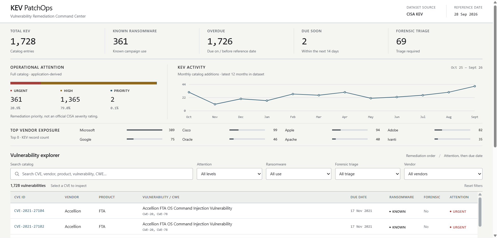
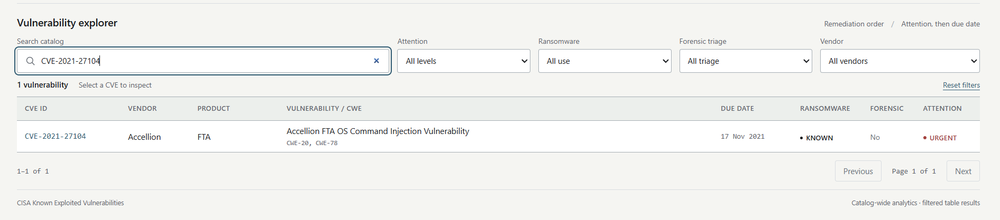
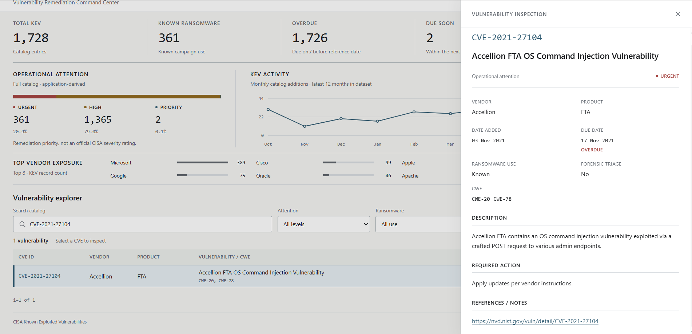

# KEV PatchOps

**Vulnerability Remediation Command Center**

KEV PatchOps is a lightweight, local web application for exploring and prioritizing vulnerabilities from the **CISA Known Exploited Vulnerabilities (KEV)** catalog.

The application is designed for Security Analysts, SOC Analysts, Vulnerability Management Teams, Security Engineers, and System Administrators who need a faster way to search, filter, review, and prioritize KEV records without working directly from the raw dataset.

The project is built with **HTML5, CSS3, and vanilla JavaScript** and runs entirely in the browser without a backend or database.

---

## Project Overview

CISA KEV contains vulnerabilities that are known to have been exploited in the wild. The catalog is useful for remediation planning, but reviewing the raw dataset directly can be inefficient when analysts need to compare large numbers of records.

KEV PatchOps turns the dataset into an operational dashboard with:

- catalog-wide summary metrics
- operational attention classification
- KEV activity over time
- top vendor exposure
- full-text vulnerability search
- multi-filter exploration
- remediation-oriented sorting
- vulnerability detail inspection
- pagination for large result sets

The interface is intentionally designed as a **data-dense analyst workstation**, not a marketing dashboard.

---

## Screenshots

> Place project screenshots inside `docs/screenshots/` and replace the paths below if necessary.

### Dashboard Overview

<!-- Replace this placeholder with your final screenshot -->
<!-- Example:

-->

`[ Screenshot: Dashboard Overview ]`

This view should show the main dashboard, including:

- KPI summary
- Operational Attention distribution
- KEV Activity chart
- Top Vendor Exposure
- Vulnerability Explorer

---

### Vulnerability Explorer

<!-- Replace this placeholder with your final screenshot -->
<!-- Example:

-->

`[ Screenshot: Vulnerability Explorer ]`

This screenshot should highlight:

- search
- combined filters
- vulnerability table
- remediation ordering
- pagination

---

### Vulnerability Detail

<!-- Replace this placeholder with your final screenshot -->
<!-- Example:

-->

`[ Screenshot: Vulnerability Detail ]`

This view should show the detail panel for a selected CVE, including the source-grounded remediation information.

---

## Core Features

### Catalog Summary

The dashboard calculates summary values directly from the loaded KEV dataset:

- **Total KEV**
- **Known Ransomware**
- **Overdue**
- **Due Soon**
- **Forensic Triage Required**

No dataset-derived metric is hard-coded.

---

### Operational Attention Level

KEV PatchOps uses an application-specific classification called **Operational Attention Level**.

This is **not an official CISA severity or risk score**.

The project uses a fixed reference date for the capstone demonstration:

```text
2026-09-28
```

Classification rules:

```text
URGENT
knownRansomwareCampaignUse = "Known"

HIGH
knownRansomwareCampaignUse != "Known"
AND dueDate <= 2026-09-28

PRIORITY
knownRansomwareCampaignUse != "Known"
AND dueDate > 2026-09-28
```

Precedence:

```text
URGENT > HIGH > PRIORITY
```

---

### KEV Activity

The application aggregates `dateAdded` values from the dataset and displays recent catalog additions as a timeline.

The chart is generated from the real dataset and does not use fabricated trend data.

---

### Vendor Exposure

The dashboard calculates vendors with the highest number of KEV entries and displays a compact comparison of the top vendors.

---

### Vulnerability Explorer

The explorer supports full-text search across:

- CVE ID
- vendor
- product
- vulnerability name
- CWE

Available filters:

- Operational Attention Level
- Ransomware Use
- Forensic Triage
- Vendor

Search and filters can be combined.

---

### Remediation Order

The default record order is:

1. URGENT
2. HIGH
3. PRIORITY

Within the same attention level, vulnerabilities are ordered by nearest due date first.

---

### Vulnerability Detail

Selecting a vulnerability opens a focused detail view containing available source fields such as:

- CVE ID
- vendor
- product
- vulnerability name
- short description
- CWE
- date added
- due date
- known ransomware campaign use
- forensic triage
- Operational Attention Level
- required action
- notes / references

Missing optional values are shown without inventing additional information.

---

## Dataset

The project uses the local CISA KEV dataset located at:

```text
dataset/known_exploited_vulnerabilities.json
```

The application reads the full dataset directly in the browser.

The dataset directory is treated as source data and should not be modified by the application.

### Main Dataset Fields

Fields used by the application include:

```text
cveID
vendorProject
product
vulnerabilityName
dateAdded
shortDescription
requiredAction
dueDate
knownRansomwareCampaignUse
forensicTriage
notes
cwes
```

KEV PatchOps does not invent external security data such as:

- CVSS scores
- exploit maturity
- threat actor names
- affected versions
- patch versions
- organization asset exposure

unless that information is already present in the supplied source data.

---

## Technology Stack

```text
HTML5
CSS3
Vanilla JavaScript
CISA KEV JSON Dataset
```

The project intentionally avoids:

- frontend frameworks
- backend services
- databases
- external charting libraries
- unnecessary build tooling

---

## Project Structure

```text
web/
├── index.html
├── styles.css
├── app.js
├── README.md
├── PRD.md
├── DESIGN.md
├── docs/
│   └── screenshots/
│       ├── dashboard-overview.png
│       ├── vulnerability-explorer.png
│       └── vulnerability-detail.png
└── dataset/
    └── known_exploited_vulnerabilities.json
```

The `docs/screenshots/` directory is optional and can be created when documentation screenshots are ready.

---

## Running Locally

Open a terminal in the project directory.

```powershell
cd C:\Users\user\Nata\IBM2026\langflow\web
```

Start a local HTTP server:

```powershell
python -m http.server 8080
```

Then open:

```text
http://localhost:8080
```

> The dataset is loaded through `fetch()`, so opening `index.html` directly with `file://` is not recommended.

---

## Design Direction

The final interface follows a restrained, operational visual direction.

Main principles:

- light neutral canvas
- strong information hierarchy
- compact data density
- table-first interaction
- restrained semantic colors
- minimal radius and shadow
- typography-led structure
- no decorative cyberpunk styling
- no glassmorphism
- no unnecessary card grids
- no fake metrics
- no generic AI-dashboard visual patterns

Typography is split between:

- **IBM Plex Sans** for interface and content
- **IBM Plex Mono** for CVE IDs, dates, technical values, and compact metadata

Status colors are used to communicate meaning, not decoration.

---

## Application States

The interface supports:

- loading
- populated
- no results
- dataset error
- edge cases

Examples of handled edge cases include:

- long vulnerability names
- long product names
- missing optional fields
- large result counts
- combined filters
- long required-action content

---

## Accessibility

The interface is designed around practical accessibility requirements, including:

- semantic HTML
- keyboard-accessible controls
- visible focus states
- sufficient contrast
- native form controls where possible
- status labels that do not rely on color alone
- accessible names for icon-only actions
- reduced-motion support where applicable

---

## Validation Checklist

Before final submission, verify:

```text
[ ] Full KEV dataset loads correctly
[ ] KPI values are computed from the dataset
[ ] Operational Attention classification is correct
[ ] Search works
[ ] Combined filters work
[ ] Result counts are accurate
[ ] Sorting follows remediation priority
[ ] Pagination works
[ ] Vulnerability detail opens correctly
[ ] Loading state behaves correctly
[ ] No-results state behaves correctly
[ ] Dataset error state behaves correctly
[ ] No contradictory loading/error/populated states
[ ] No JavaScript console errors in the main flow
[ ] Charts use real dataset values
[ ] Layout remains usable on desktop and tablet
```

---

## Project Documentation

Two supporting documents are included in the project root:

### `PRD.md`

Defines:

- product goal
- problem statement
- target users
- functional requirements
- business rules
- dataset usage
- technical scope
- acceptance criteria

### `DESIGN.md`

Defines:

- visual direction
- anti-AI-slop rules
- typography
- color usage
- iconography
- spacing
- table behavior
- accessibility
- interaction states
- responsive behavior

---

## Scope

KEV PatchOps is intended as a vulnerability exploration and remediation-support interface.

It is not:

- an official CISA risk scoring system
- a vulnerability scanner
- an exploit detection platform
- an asset inventory
- an automated patch deployment tool
- a replacement for security analyst judgment

---

## Capstone Context

KEV PatchOps was developed as an IBM Bob capstone project using a layered prompting workflow:

```text
Layer 1 — Role & Context
Layer 2 — Task & Requirements
Layer 3 — Constraints & Output
```

The project separates functional requirements from visual constraints through `PRD.md` and `DESIGN.md`, allowing targeted refinement without rewriting the entire project specification.

---

## License and Data Attribution

Application code in this project follows the licensing terms chosen by the project author.

The vulnerability dataset is sourced from the **CISA Known Exploited Vulnerabilities (KEV) Catalog**.

Refer to the source dataset repository and included dataset license/documentation for its applicable terms.

---

## Author

**Rahmat Hadinata**  
Politeknik Negeri Lampung
